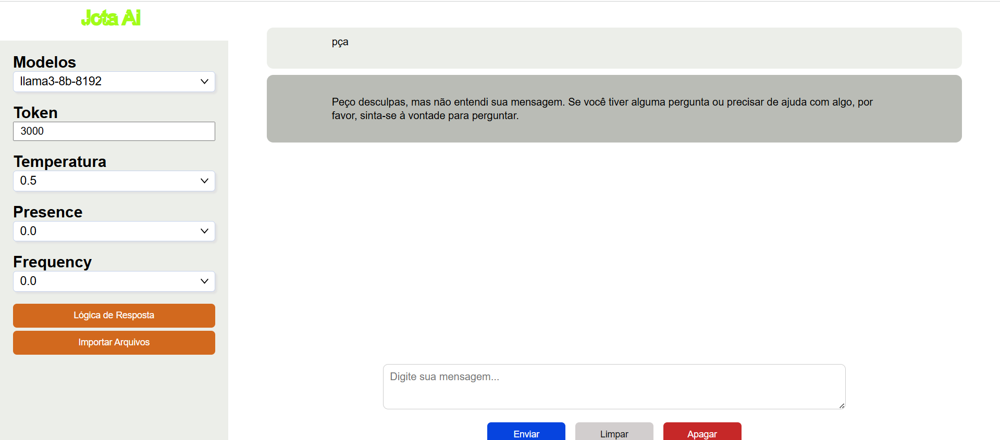

# 🧠 AI Chat - MSG

Uma aplicação Node.js com Express que integra a API da **Groq** para criar um sistema de chat inteligente, com armazenamento de histórico em arquivos JSON. Ideal para interações persistentes com modelos de linguagem.

**IDEAL PARA CONCENTRAR AS INFORMAÇÕES DE UM ÚNICO ASSUNTO, USANDO DIVERSAS LLMs DISPONÍVEIS NA API GROQ.**

## 📁 Estrutura do Projeto

AI\_CHAT-MSG/
├── server/
│   └── src/
│       ├── api/
│       │   └── server.js              # Inicializa o servidor Express
│       ├── routes/
│       │   └── rotaChat.js            # Define a rota /api/chat
│       ├── controllers/               # Lógica do backend
│       │   ├── atualizarLog.js
│       │   ├── chat.js
│       │   ├── contarTokens.js
│       │   ├── deletarArquivosImportados.js
│       │   ├── deletarArquivosProcessados.js
│       │   ├── deletarLog.js
│       │   ├── enviarMensagem.js
│       │   ├── escolherModelo.js
│       │   ├── importarArquivo.js
│       │   ├── limitarlog.js
│       │   ├── listaHistorico.js
│       │   ├── listarArquivosImportdos.js
│       │   ├── listarArquivosProcessados.js
│       │   ├── listarLog.js
│       │   ├── processarArquivos.js
│       │   ├── resumirTexto.js
│       │   ├── salvarMensagens.js
│       │   └── sanitizar.js
├── log/                              # Diretório com arquivos de histórico (JSON)
├── .env                              # Configuração: chave da API da Groq, etc.
├── package.json
└── README.md

## 🚀 Tecnologias Utilizadas

- **Node.js** e **Express**: Servidor e gerenciamento de rotas.
- **API da Groq**: Integração com modelo de linguagem.
- **JSON Files**: Armazenamento persistente do histórico de conversas.
- **ES6 Modules**: Organização moderna do código.

## ⚙️ Como Configurar e Rodar o Projeto

### 1. Clonar o Repositório

git clone <https://github.com/seuusuario/AI_CHAT-MSG.git>
cd AI_CHAT-MSG

### 2. Instalar as Dependências

npm install

### 3. Configurar o Arquivo `.env`

## Crie um arquivo chamado `.env` na raiz do projeto com o seguinte conteúdo

    - CONTEUDO O .env
    GROQ_API_KEY = <chave key groq>
    PORT = 80
Substitua `sua-chave-da-groq-aqui` pela sua chave da API Groq.

### 4. Iniciar o Servidor
  
  npm start

O servidor será iniciado na porta definida (por padrão, 80 ou conforme variável de ambiente).

## 💬 Como Funciona

1. **POST para `/api/chat`**

   O cliente envia:

   - `mensagem`: Texto do usuário.
   - `orientacao`: (Opcional) Prompt/instruções.
   - `historico`: (Opcional) Histórico salvo.
   - `modelo`: (Opcional) Código do modelo LLM.
   - Outras configurações opcionais (temperatura, penalties...).

2. **Processamento Interno**

   - O histórico, arquivos e orientações são combinados.
   - O contexto é enviado para a API Groq.
   - A resposta é limpa e retornada.

3. **Armazenamento**

   - Conversas são salvas como JSON no diretório `log/`.

---

## 📸 Demonstrações Visuais

Abaixo estão algumas capturas de tela do funcionamento do sistema **AI Chat - MSG**.
**➤ Coloque as imagens na pasta `imgs/` na raiz do projeto** com os nomes correspondentes:

### 📥 Upload de Arquivos

### 🧠 Interação com LLM (Chat)

### 🧾 Histórico Salvo

### 📂 Arquivos Processados

### 🧹 Limpeza de Diretórios

---

## 🐞 Erros Comuns

- **GROQ\_API\_KEY ausente**
  ➤ Verifique se o `.env` foi criado corretamente.

- **Histórico vazio ou corrompido**
  ➤ Confira os arquivos no diretório `log/`.

- **Modelo não especificado**
  ➤ Sempre inclua o campo `modelo` na requisição.

---

## 🤝 Contribuindo

Contribuições são bem-vindas!

- Abra **issues** com sugestões ou bugs.
- Envie **pull requests** com melhorias.

---

## 📄 Licença

Sistema de estudos privado para uso pessoal e educacional.

---

Feito com 💬 por **João Tavares**
